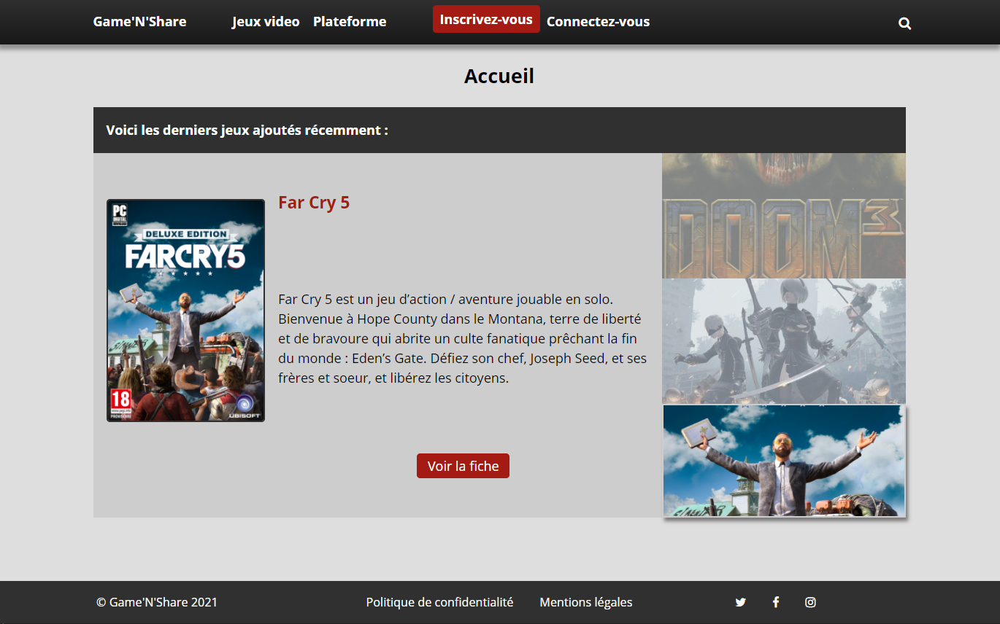
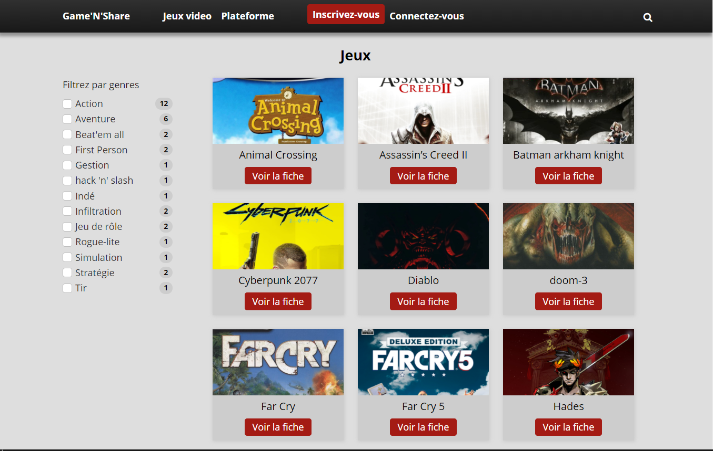

# Game 'N' Share

Un site de création de ludothèque personnelle sur WordPress

Projet réalisé avec [Vincent Zepharren](https://github.com/zephdev-92)

## Technos 

| BACK-END:| FRONT-END:|
 |:-------------|----------:|
|  PHP    |  JavaScript |
|  APACHE  |  Sass |
|  MySQL |  jQuery |
|  phpMyAdmin |  Ajax |
|Composer||
|WordPress||

## Screenshots

- Home page

- Page des jeux

- Page d'un seul jeu

